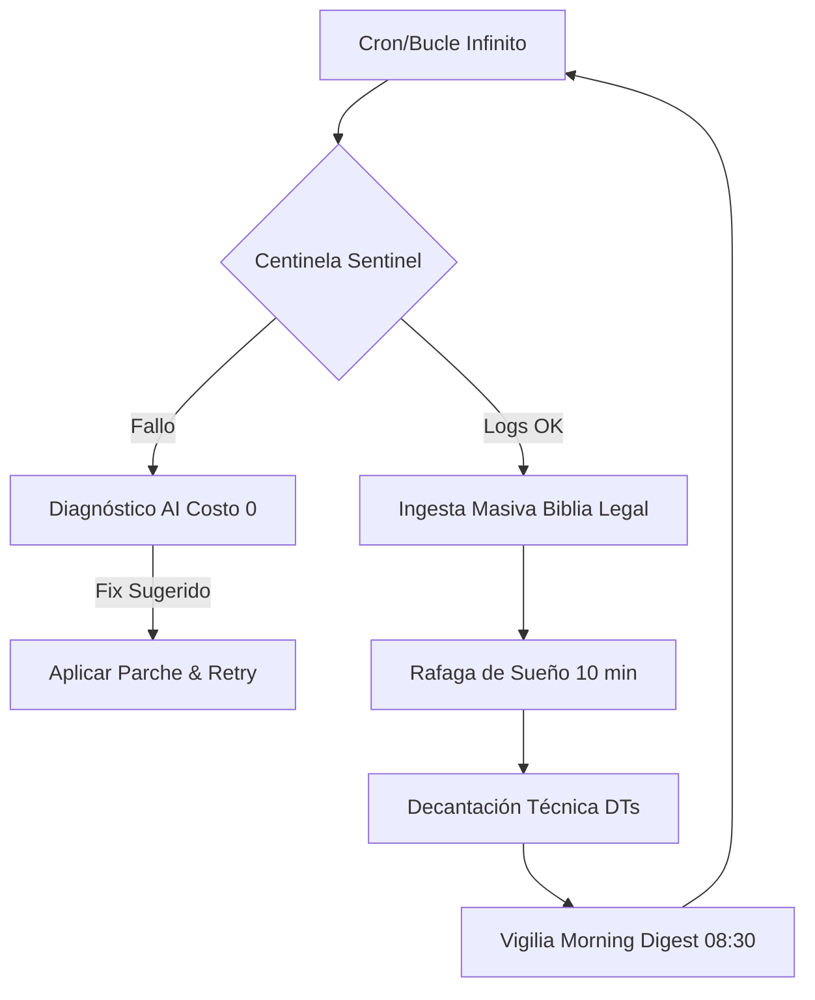

# 🏛️ Arquitectura Soberana — OpenGravity SICC v9.5.5 "Advisor Strategy"
## 🌌 Visión General

La arquitectura de **OpenGravity** está diseñada para la **Sovereignty Technological Total** y la **Auditoría Forense Sistémica**. Opera bajo la metodología de validación contractual Punto 42, asegurando que cada ítem de ingeniería tenga un respaldo literal en el Contrato Maestro.

---

## 🏛️ Estructura de Triple Repositorio (3-Repo Sovereign System)

| Repositorio | Rol | Tecnología |
| :--- | :--- | :--- |
| **Agente** | Motor de ejecución, Auditor forense, Bot Telegram | Node.js, Docker |
| **Brain** | SSOT: Metodología Punto 42, RED, DBCD, Identidad | Markdown, JSON |
## 🏗️ Pilares del Diseño (v9.4)

-   **Modularidad de Repositorios (3-Repo Sync):** Separación física de Lógica (Agente), Conocimiento (Brain) y Entregables (LFC2).
-   **Escudo Fiscal Cuádruple:** Prioridad absoluta de gasto $0.00: `Ollama (Local)` -> `Gemini Free` -> `Groq Free` -> `OpenRouter Free`.
-   **Muro de Fuego Fiscal (v9.3):** Prohibición de escalación automática a Sonnet. Requiere firma manual de Diego en `SICC_OPERATIONS.md`.
-   **Morning Digest & Búfer Michelin (v9.4):** 
    - Supresión de notificaciones rutinarias durante el procesamiento masivo.
    - Acumulación de hallazgos en `data/logs/michelin-findings.json`.
-   **Orquestación Advisor & Evolución Genética (v9.5):**
    - **Capa Advisor:** Ruteador inteligente (Cloud Free/Local) que selecciona especialistas.
    - **Aprendizaje Genético:** El sistema documenta propuestas de mejora en `brain/GENETIC_EVOLUTION.md`.
    - **Soberanía Híbrida:** Prioridad en modelos Cloud Free de alto contexto (1M) con fallback local obligatorio.
-   **Modo Factoría Serial (v8.8.1):** 
    - Orquestación serial de Peones locales (`qwen2.5:1.5b`) para minería forense de bajo impacto.
    - Sistema de **Enfriamiento de CPU (>85%)** para resiliencia del host.
-   **Tablero de Operaciones (Dashboard):** 
    - Centralización en `brain/SICC_OPERATIONS.md` para auditoría humana rápida.
    - Notificaciones Push vía Telegram para `BLOCKERS` y `DTs`.

---

## 🔄 Protocolos Operativos (The Loops)

### 1. Karpathy Loop v8.2 (Forensic Review)
Validación de 5 fases con **Saneamiento de Nomenclatura**. Detecta términos legacy en la WBS y entregables, procediendo a su purga para evitar "Lock-in" tecnológico. Divide el diseño en Mandatos Legales y Criterios Ajustables.

### 2. Motor de Dictámenes & Sync Masterchef
- **Batch Masterchef:** Purga y servido transversal mediante `node scripts/lfc-cli.js [purify|serve]`.
- **Portal Soberano:** Sincronización automática con `https://lfc-2.vercel.app/` tras cada purificación de ADN.

### 3. SICC Dreamer (Autonomía de Saneamiento)
- **Ciclo Cron:** Ventana de **8:00 PM - 7:00 AM (COL)**.
- **Misión N-1:** El Dreamer está facultado para redactar DTs de supresión masiva basadas en los hallazgos del reporte RED.

---

## 🛡️ Capacidades de Soberanía v8.4 (Implemented)

### 1. SICC Sweep & Resiliency Orchestrator
Script `sicc-sweep.js` y lógica de `agent.js` para ejecutar auditorías recursivas y garantizar la continuidad del servicio ante fallos de proveedores externos.
- **Ruta de Logs de Monitoreo:** `/home/administrador/docker/agente/data/logs/flow-resilience.json` (Purga mensual recomendada).

### 2. Flujo Asimétrico (Ejecutor + Asesor)
Uso de modelos rápidos (Peones) para el bulto del trabajo y escalado a modelos de alta inteligencia (Asesores) solo para decantación y bloqueos críticos. Generación automática de **Blockers** para razonamiento conjunto Diego-Agente.

### 3. SICC Sentinel (Auto-Saneamiento v1.0)
El `sicc-sentinel.js` actúa como un "wrapper" inteligente sobre el motor de ingesta masiva.
- **Detección:** Captura errores 429, 500 y de sistema (PDFinfo/PDFTOPPM).
- **Inferencia:** Consulta al Multiplexador Free (OpenRouter/Groq/Google) para obtener diagnósticos de "Costo $0".
- **Reparación:** Capacidad de aplicar cambios de configuración y re-intentar la ingesta automáticamente.

---

## 🌙 Arquitectura de Guardia Nocturna (The Night Shift)

---
v9.9 Michelin "Night Shift Edition" — 14/04/2026
