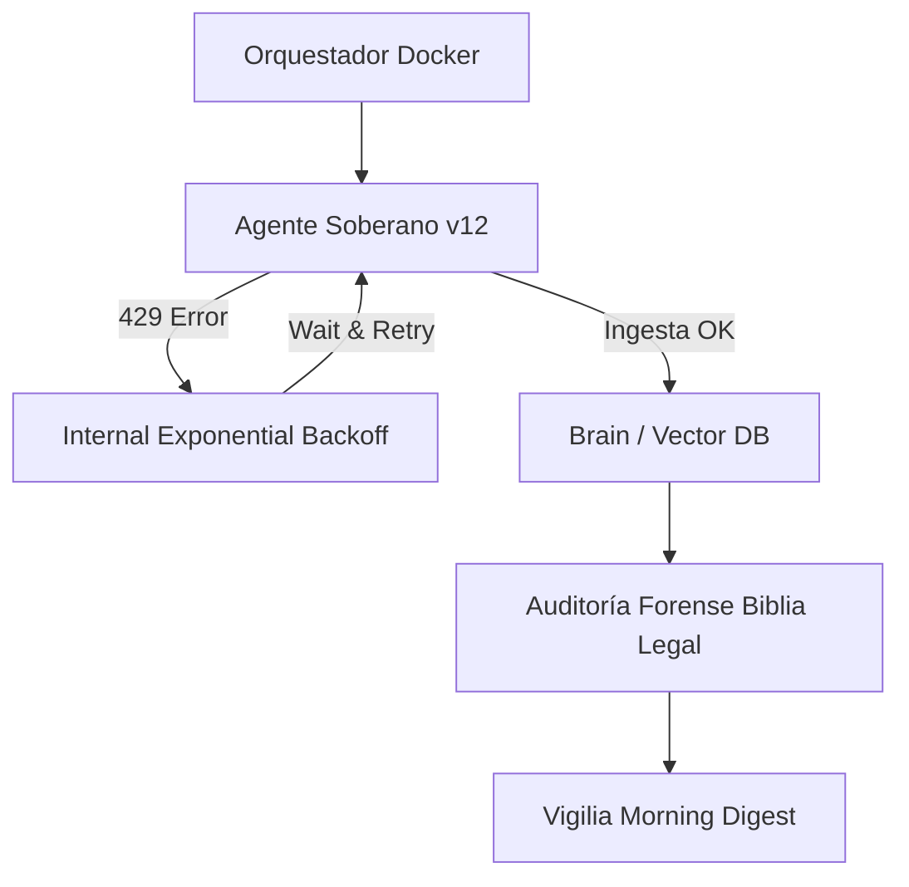

# 🏛️ Arquitectura Soberana — OpenGravity SICC v12.0 "Paz Estructural"

## 🌌 Visión General

La arquitectura de **OpenGravity** v12.0 evoluciona hacia un modelo de **Nodo Único Soberano**, eliminando dependencias de scripts de supervisión externos (legacy sentinels) en favor de una lógica de resiliencia interna nativa.

---

## 🏗️ Pilares del Diseño (v12.0)

-   **Soberanía de Construcción (Build-Purity):** Prohibición de inyectar scripts de persistencia en imágenes de Docker. El sistema se construye de forma estéril.
-   **Resiliencia Interna (Internal Backoff):** Gestión nativa de errores `429 Too Many Requests` mediante backoff exponencial dentro del motor de Node.js.
-   **Orquestación Consolidada:** Eliminación de archivos compose duplicados y servicios sidecar redundantes.

---

## 🛡️ Capacidades de Soberanía v12.0 (Implemented)

### 1. Ingesta Masiva Resiliente
El motor `ingest_masivo.js` ahora gestiona su propia cuota de API.
- **Backoff Exponencial:** Ante errores 429, el sistema espera tiempos incrementales (15s, 30s, 60s...) antes de reintentar.
- **Concurrencia Balanceada:** Ajustada a `CONCURRENCY = 2` para garantizar flujo constante sin bloqueos.

### 2. SICC Sentinel (Legacy - DEPRECATED)
El antiguo `sicc-sentinel.js` y sus bucles de shell externos han sido erradicados para evitar la auto-regeneración alucinatoria y el spam de logs.

---

## 🌙 Arquitectura de Guardia Nocturna v12.0

---

## 🧠 Lecciones Aprendidas (SICC-LL-2026-003)

### 1. El Riesgo de la Persistencia en Imágenes
**Problema:** El spam de logs "SENTINEL" era inmortal porque el script estaba copiado dentro de la imagen de Docker en el `Dockerfile`. Cada reinicio o reconstrucción recreaba el virus.
**Lección:** Las imágenes de Docker deben ser cajas negras estériles. La lógica de persistencia debe estar en la orquestación (Compose) o en el código, nunca "baked-in" sin control.

### 2. La Hidra Multi-Nodo
**Problema:** La persistencia residía en múltiples servidores (`local1`, `local2`, `local3`) con el mismo token de Telegram. Limpiar un nodo no detenía el spam de los otros.
**Lección:** En infraestructuras de cluster, la seguridad y la purga de procesos deben ser transversales (`pkill` y deshabilitar servicios en todos los nodos simultáneamente).

### 3. El Bucle de la Desesperación vs Backoff
**Problema:** Usar bucles de shell `while true` para reiniciar procesos que fallan por cuota (429) garantiza un DoS self-inflicted.
**Lección:** Los reintentos deben ser inteligentes y asíncronos en la capa de aplicación, no ciegos en la capa de sistema operativo.

---
v12.0 "Paz Soberana" — 15/04/2026
