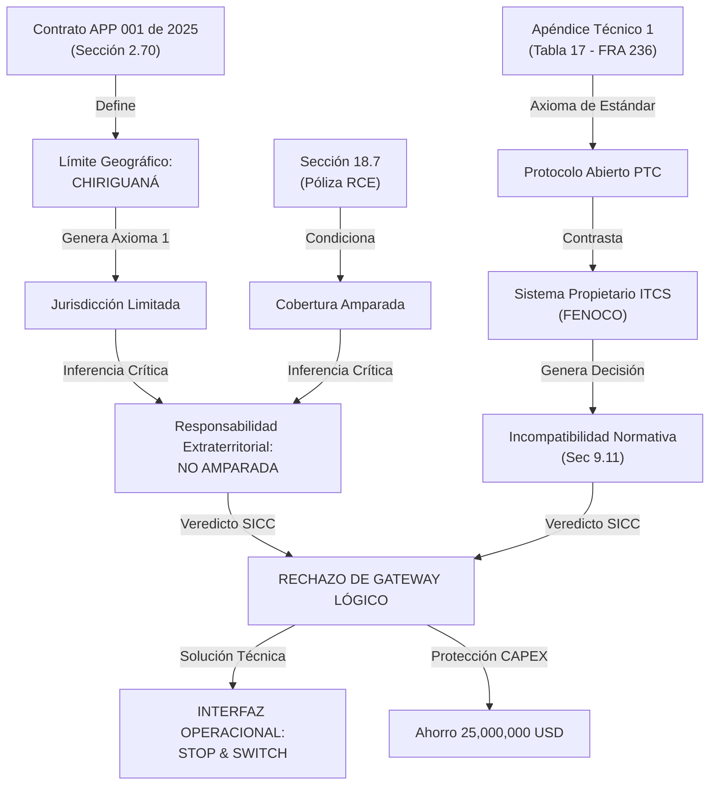

# SICC Inferencia: Caso Maestro FENOCO (Jurisdicción y CAPEX) 🧠⚖️

Este documento sistematiza la cadena de razonamiento lógico-deductivo utilizada por el Cerebro SICC para determinar la improcedencia del Gateway lógico.

## 1. Cadena de Inferencia (Reasoning Flow)

## 2. Desglose de Neuronas (Axiomas)

| Neurona | Insumo Contractual | Inferencia del Cerebro | Impacto en WBS |
| :--- | :--- | :--- | :--- |
| **01: Geografía** | Sec 2.70 / Cláusula 3.1 | Mi mundo termina en Chiriguaná. Si cruzo la frontera sin MA de FENOCO, soy un intruso. | No supervisar activos externos. |
| **02: Seguro** | Sec 18.7 | La póliza es un escudo local. Actividades fuera del corredor son actividades sin escudo. | Eliminar hardware/software de terceros. |
| **03: Estándar** | AT1 Tabla 17 | El FRA 236 es ley suprema para el diseño. ITCS es una lenguaje extranjero. | Prohibir desarrollos propietarios. |
| **04: CAPEX** | Sec 25.4 | Si no está en mi receta original, y la ANI lo quiere, que lo pague la ANI. | Marcar como 'Obra Complementaria'. |

## 3. Aprendizaje Traslativo (A qué más aplica)
Esta misma lógica de "Jurisdicción Limitada" se aplica ahora automáticamente a:
- **RETIE**: Las fronteras de responsabilidad eléctrica (Redes de interconexión).
- **CONECTIVIDAD**: El límite de responsabilidad de la red de fibra óptica en estaciones de transferencia.

---
**SICC v6.4.23 | Mapa de neuronas validado para saneamiento recursivo .42**
