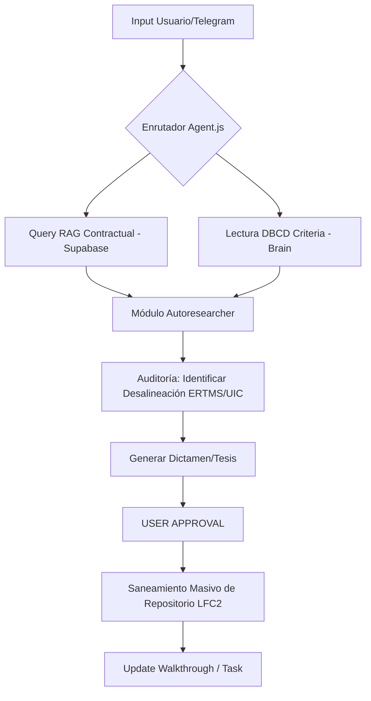

# 🏗️ Arquitectura del Sistema Antigravity — Autoresearch & Optimization
> **Última actualización:** 2026-03-13 · **Versión:** 2.0.0 "Autoresearcher LFC"

## 🧠 El Cerebro Centralizado (Metodología Autoresearch)

El sistema ha evolucionado de un simple RAG a un **Agente de Investigación Automática (Autoresearch)** inspirado en arquitecturas de agentes profundos. No solo busca información; la **audita** contra una Fuente Única de Verdad (SSOT).

### 📐 SSOT: DBCD_CRITERIA.md
El `DBCD_CRITERIA.md` actúa como el **Filtro de Verdad Maestro**. Todo output generado por la IA, ya sea basado en RAG o en conocimiento general, debe pasar por este filtro:
1. **RAG (Supabase):** Recupera lo que dice el contrato/documento "zombie".
2. **DBCD (Brain):** Define lo que la ingeniería **debe ser** (ej. PTC Virtual, No señales).
3. **Agente (Audit):** Identifica la brecha, genera una **Tesis** y propone el **Saneamiento**.

---

## 🛰️ Capas de Inteligencia

### 1. Capa de Contexto (Context Layer)
- **Supabase (Local):** Almacena vectores de miles de páginas de los Apéndices Técnicos.
- **Brain Files:** Markdown files (`LFC_ROLE.md`, `DBCD_CRITERIA.md`) inyectados en el System Prompt.

### 2. Capa de Investigación (Autoresearch Loop)
Basado en `github.com/karpathy/autoresearch`, el agente sigue este ciclo:
- **SCAN:** Lee carpetas enteras en `/repos/LFC2/`.
- **EVALUATE:** Compara contenidos con el `DBCD_CRITERIA.md`.
- **REPORT:** Genera un "Dictamen de Saneamiento" o "Tesis Técnica".
- **EXECUTE:** Realiza las correcciones masivas en los archivos del repositorio.

---

## 🛠️ Flujo de Trabajo del Agente

---

## 🐳 Estructura de Datos y Volúmenes

| Volumen | Propósito | Fuente de Verdad |
|---|---|---|
| `/app/data/brain/` | **SSOT (Single Source of Truth)** | `DBCD_CRITERIA.md` |
| `/app/repos/LFC2/` | **Espacio de Trabajo (Work Area)** | Repositorio a ser saneado |
| `/app/temp/` | **Scratchpad de Investigación** | Archivos temporales de análisis |

---

## 🚀 Próximas Implementaciones (Roadmap Autoresearch)

| Feature | Descripción | Estado |
|---|---|---|
| **Audit Loop** | Capacidad del agente para escanear directorios y encontrar "zombies" solo. | ✅ Implementado |
| **DBCD Filter** | Post-procesamiento de respuestas RAG para asegurar alineación con PTC Virtual. | ✅ Implementado |
| **Deep Research Report** | Generación automática de documentos de +2000 palabras analizando un tema técnico. | 🔄 En desarrollo |
| **Recursive Debugging** | El agente se auto-corrige si el RAG le da información contradictoria con el DBCD. | 🔄 En desarrollo |
