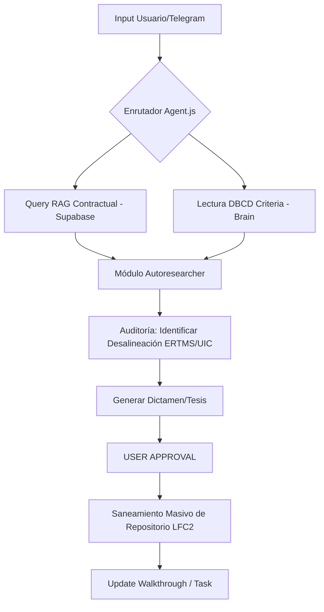

# Arquitectura del Agente LFC v2.2.1 "Premium UX & Optimizer"
> **Evolución:** Autoresearcher + DT Lifecycle + POSIX Automation + UX/UI Advisor
**Última actualización:** 2026-03-13 · **Versión:** 2.2.1 "Autoresearcher LFC"

## 🧠 El Cerebro Centralizado (Metodología Autoresearch)

El sistema ha evolucionado de un simple RAG a un **Agente de Investigación Automática (Autoresearch)** inspirado en arquitecturas de agentes profundos. No solo busca información; la **audita** contra una Fuente Única de Verdad (SSOT).

### 📐 SSOT: DBCD_CRITERIA.md
El `DBCD_CRITERIA.md` actúa como el **Filtro de Verdad Maestro**. Todo output generado por la IA, ya sea basado en RAG o en conocimiento general, debe pasar por este filtro:
1. **RAG (Supabase):** Recupera lo que dice el contrato/documento "zombie".
2. **DBCD (Brain):** Define lo que la ingeniería **debe ser** (ej. PTC Virtual, No señales).
3. **Agente (Audit):** Identifica la brecha, genera una **Tesis** y propone el **Saneamiento**.

---

## 🛰️ Capas de Inteligencia

### 1. Capa de Contexto (Context Layer)
- **Supabase (Local):** Almacena vectores de miles de páginas de los Apéndices Técnicos.
- **Brain Files:** Markdown files (`LFC_ROLE.md`, `DBCD_CRITERIA.md`) inyectados en el System Prompt.

### 2. Capa de Investigación (Autoresearch Loop)
Basado en `github.com/karpathy/autoresearch`, el agente sigue este ciclo:
- **SCAN:** Lee carpetas enteras en `/repos/LFC2/`.
- **EVALUATE:** Compara contenidos con el `DBCD_CRITERIA.md`.
- **PROPOSE (New):** Genera una **Tesis Técnica** (Borrador de DT).
- **CONVERSE (New):** Discute la Tesis en Telegram con el usuario (Aprobación/Ajuste).
- **EXECUTE:** Genera el archivo DT final en `II. Apendices Tecnicos/Decisiones_Tecnicas/` y aplica los cambios.

### 3. Capa de Automatización (CLI)
La automatización del repositorio `LFC2` ha sido migrada de PowerShell a Node.js:
- **CLI Tool:** [lfc-cli.js](file:///home/administrador/docker/LFC2/scripts/lfc-cli.js)
- **Engine:** Node.js v20+
- **Converter:** Pandoc v3.6.2 (Linux x86_64 portable)
- **Comandos:** `sync` (Sincronización WBS), `cook` (Transformación ejecutiva), `serve` (Exportación empresarial).

### 4. Capa de Diseño UX/UI (New)
El agente actúa como un consultor de diseño premium para los tableros HTML:
- **Criterios:** Basados en `UX_DESIGN_SYSTEM.md` (Glassmorphism, HSL tailors, micro-animations).
- **Proceso de Mejora:** Escaneo de archivos HTML -> Propuesta UX vía Telegram (¿Qué?, ¿Por qué?, Usabilidad) -> Implementación vía DT.

### 5. Optimización de Arquitectura (Tokens Efficiency)
- **Poda de Contexto:** El agente detecta cuando hay "surplus de tokens" para proponer refactorizaciones que mejoren el rendimiento y la legibilidad del código/documentación.

---

## 📄 Ciclo de Vida de la Decisión Técnica (DT)

El DT es el artefacto formal de cambio. Sigue un formato híbrido:
1. **Markdown:** Justificación técnica y legal para humanos (Especialistas/Interventoría).
2. **YAML (.Section 10):** Instrucciones parseables para que el agente ejecute cambios masivos en WBS, Cronogramas y Carpetas Técnicas.

### Flujo de Optimización Continua:
`Detección (Agente) --> Tesis (Telegram) --> Iteración (Human-in-the-loop) --> DT Final (Git) --> Ejecución (Agente) --> Verificación (DBCD)`

## 🛠️ Flujo de Trabajo del Agente

---

## 🐳 Estructura de Datos y Volúmenes

| Volumen | Propósito | Fuente de Verdad |
|---|---|---|
| `/app/data/brain/` | **SSOT (Single Source of Truth)** | `DBCD_CRITERIA.md` |
| `/app/repos/LFC2/` | **Espacio de Trabajo (Work Area)** | Repositorio a ser saneado |
| `/app/temp/` | **Scratchpad de Investigación** | Archivos temporales de análisis |

---

## 🛡️ Matriz de Trazabilidad (Traceability Matrix)
Para evitar alucinaciones, el agente implementa una trazabilidad obligatoria:
- **ID de Cambio:** Referencia al archivo modificado.
- **Justificación P.42:** Por qué se cambia (basado en Metodología).
- **Criterio SSOT:** Cuál ID del `DBCD_CRITERIA.md` obliga al cambio (ej. `DBCD-C1: PTC Virtual`).

---

---

## 🚀 Próximas Implementaciones (Roadmap Autoresearch)

| Feature | Descripción | Estado |
|---|---|---|
| **Audit Loop** | Capacidad del agente para escanear directorios y encontrar "zombies" solo. | ✅ Implementado |
| **DBCD Filter** | Post-procesamiento de respuestas RAG para asegurar alineación con PTC Virtual. | ✅ Implementado |
| **Deep Research Report** | Generación automática de documentos de +2000 palabras analizando un tema técnico. | 🔄 En desarrollo |
| **Recursive Debugging** | El agente se auto-corrige si el RAG le da información contradictoria con el DBCD. | 🔄 En desarrollo |
